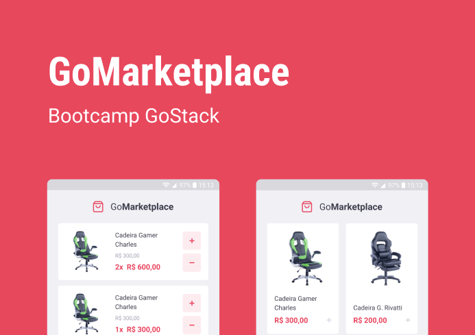
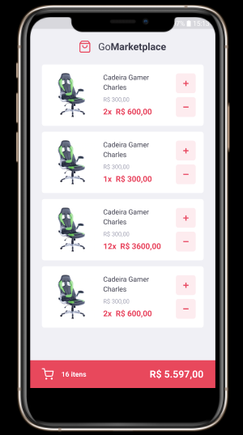
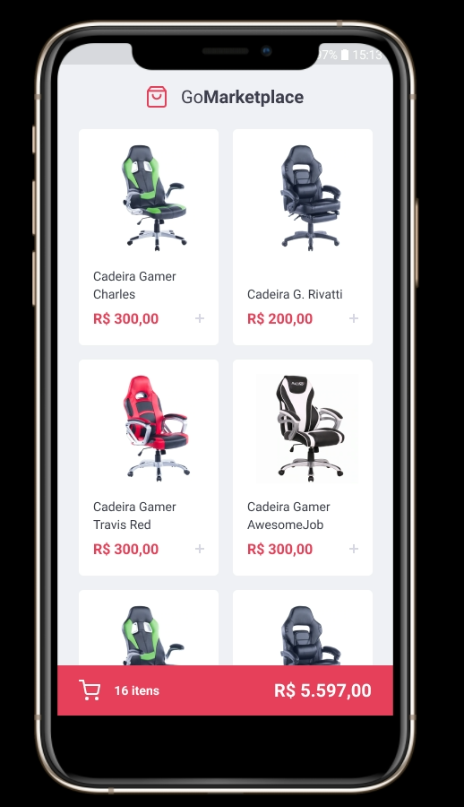

<h1 align="center">
      
</h1>

<h3 align="center">
 Desafio fundamentos React Native
</h3>

In this challenge, GoMarketplace was developed, applying what I have learned so far in React Native, along with TypeScript, using routes, Async Storage and the Context API.

  <a href="#rocket-technologies">Technologies</a>&nbsp;&nbsp;&nbsp;|&nbsp;&nbsp;&nbsp;
  <a href="#-how-to-use">How to use</a>&nbsp;&nbsp;&nbsp;|&nbsp;&nbsp;&nbsp;
  <a href="#memo-license">License</a>

  

     
        
         

 
 

## :rocket: Technologies

 
This app features all the latest tools and practices in mobile development!
 
 

- [React Native](https://facebook.github.io/react-native/)
- [TypeScript](https://www.typescriptlang.org/)
- [Axios](https://github.com/axios/axios)
- [Json ](https://github.com/typicode/json-server)

## 📢 How to use

 

**📱 Mobile (React Native)**

 

Step 1 - Access our application's mobile folder, download the npm packages used in the project with the command: `npm install` , if you prefer yarn execute `yarn`;

Step 3 - Start the application with the command: `npm run start`, if you prefer yarn run `yarn start`;

 
 

## :memo: License

 
This project is licensed under the MIT License - see the details in <a href="https://opensource.org/licenses/MIT">page</a>.

---

Make with :purple_heart:
